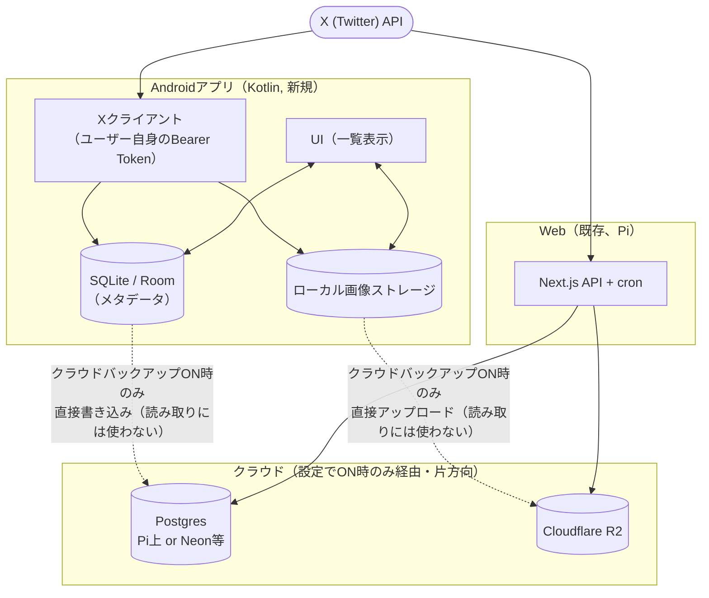
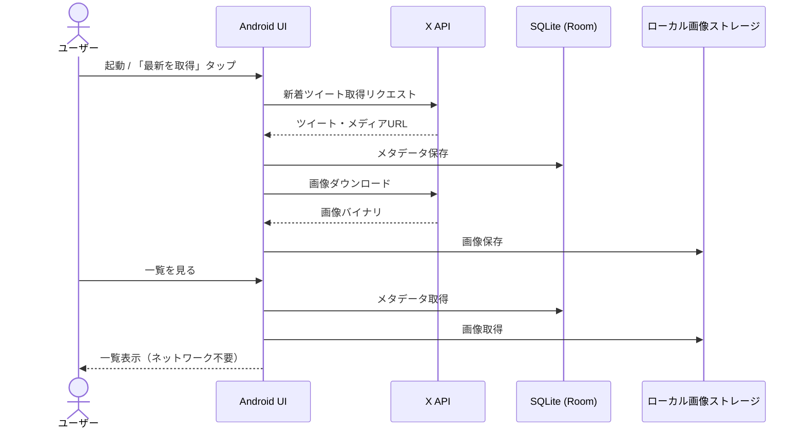
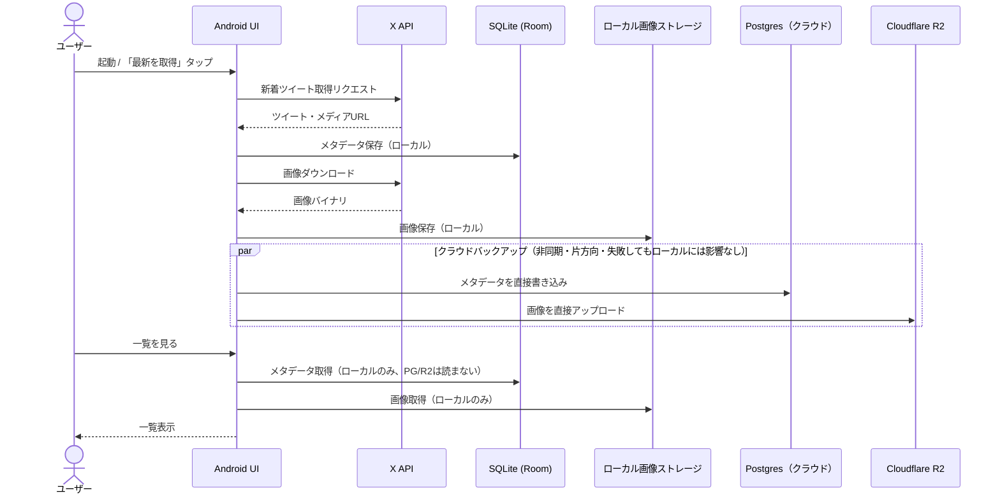

# Androidアプリ化 設計書

## 1. 背景・目的

- 現状はNext.js（Web）+ Postgres（自前ホスト、Pi）+ Cloudflare R2の構成。
- それぞれのユーザーが自分の推しメンの投稿画像をそれぞれの端末で管理できるようにすることで、当該システムへの参入ハードルを下げる（1人の運用者が全員分のクロール・DB・ストレージを抱え込む必要がなくなる）。
- 検討の結果、**Web/Androidの両方から同じデータを見られるようにする**（同一ユーザーの複数クライアント）ことを目的とし、他人と使い回す前提のマルチテナント化は行わない。

## 2. 検討して見送った選択肢

| 案 | 見送った理由 |
|---|---|
| RDS (PostgreSQL) | db.t4g.micro単体でも約$18.3/月、20GBストレージ込みで約$21/月。この負荷量（60分に1回、数十件のバッチ）に対して固定費が割高。 |
| DynamoDB | オンデマンド課金なら月$1〜2程度で激安だが、JOIN・複合ソート・GINインデックス相当の絞り込みを多用する現スキーマとは相性が悪く、単純な移行では済まない。 |
| Aurora Serverless v2 | 最小0.5ACU × $0.15/ACU時間 = 常時起動で約$54.75/月となり、素のRDS小型インスタンスより高い。スケールツーゼロも復帰レイテンシがあり、Webアプリの常時アクセスとは相性が悪い。 |
| Neon / Supabase（サーバーレスPostgres） | pgvector込みでスキーマ変更なしに移行でき、アイドル時は課金ほぼゼロ。**コストだけなら本命**だが、別アカウント作成の手間が発生する。今回はPi継続でいったん保留。 |
| 全部端末ローカル完結（クラウド無し） | Web/Androidで同じデータを見たいという要件と矛盾するため却下（正本が無いと同期できない）。 |
| 友達に課金してX API/R2/DBを肩代わりするモデル | X Developer Agreementの再配布/転売禁止条項に抵触する可能性が高い。日本国内での課金は特定商取引法表示・インボイス対応など事業者寄りの負担も発生する。 |
| 各ユーザーが自分のX/R2/クラウドDBアカウントを用意する多人数モデル | ユースケースが「友達に見せる」だけで、複数ユーザーが同じ対象アカウントを購読する状況が実質発生しないため、共有クロールの最適化自体が不要と判明。オンボーディングの手間だけが残るので却下。 |
| Tauri（Android対応） | 既存React UIを流用できるのは魅力だが、Tauri 2.0のモバイル対応はデスクトップほど枯れておらず、バックグラウンド実行やWebView経由の権限まわりで詰まりやすい。 |

## 3. 採用する構成

### 3.1 全体像

Web版とAndroid版は別々にXへアクセスする（共有クロールはしない）。Android設定でWebと同じPostgres/R2を向ければ、結果として同じデータをWeb/Androidの両方から見られる（＝APIレイヤーで繋がっているわけではなく、同じDB/バケットを直接共有しているだけ）。

#### 3.1.1 データフロー: Android単体版（クラウドバックアップOFF）

#### 3.1.2 データフロー: クラウドバックアップ有効時

### 3.2 メタデータ

- **読み取り・一覧表示は常にローカルSQLite（Room）を見る**。クラウドバックアップの有無に関わらず、描画経路はローカル固定。
- デフォルトはSQLite（Room）のみ。
- 「クラウドバックアップ」をONにした場合のみ、ローカルSQLiteへの書き込みに加えて、設定画面で入力したPostgres接続文字列に**Androidアプリから直接**も書き込む（＝読み取りには使わない、片方向のミラー書き込み）。
- Web/Androidで同じデータを見たい場合は、Android側の設定でWebと同じPostgresを指すようにするだけでよい（API層での同期の仕組みは不要）。
- 将来的にPiの運用コストが気になった場合はNeon/Supabaseへの載せ替えを検討（スキーマ変更なしで移行できる想定）。
- `app_users`/`user_subscriptions`（OIDCログイン）は**Web版のみの話**。Web版は外部公開しているため不正アクセス防止として引き続き必要。Androidはユーザー管理を持たない（端末単位のアクセスで完結するため不要）。

### 3.3 画像

- 目的は「一覧表示の速度」であり、当初懸念していた「X側の削除・凍結対策」ではないと判明。
- **表示は常に端末ローカルストレージから**。一度表示した画像を保存しておき、2回目以降はネットワークアクセスなしで即表示。
- 「クラウドバックアップ」をONにした場合のみ、ローカル保存に加えて設定画面で入力したR2/S3のクレデンシャルを使ってAndroidアプリから**直接**アップロードする（表示には使わない、片方向のバックアップのみ。こちらもPiは経由しない）。

### 3.4 顔検出

- Pi側は既存のBlazeFace（`frontend/worker/faceDetect.js`）を継続。
- Android側での顔検出は**ML Kit Face Detection**（Google純正・オンデバイス・無料）を使う。

### 3.5 バッチ/同期タイミング

- Androidアプリが自分のX APIキーで取得しクラウドバックアップに同期する運用になるため、**Pi側のcron（60分毎、`frontend/worker/batch.js`）は停止する**。並行して動かすと同じアカウントを二重に取得してしまい、X API課金・クロールが無駄に倍になるため。
  - トレードオフ: Web版の新着表示は、Androidアプリがクラウドバックアップを同期したタイミングに依存するようになる（Androidを開かない限りWeb側にも新着が反映されない）。
- Androidアプリは常時バックグラウンド実行を前提にしない。起動時、または手動の「最新を取得」ボタンでAPIを叩く形でよい（このユースケースでは十分）。
  - 必要であればWorkManagerで数時間おきの定期同期を追加してもよいが、必須要件ではない。

## 4. 未確定・今後の検討事項

- Piの運用コスト削減が必要になった時点で、Postgresのホスティング先をNeon/Supabaseに切り替えるかどうか。
- Android⇄クラウド間の同期方式（バックアップ書き込みの失敗時リトライ・キューの設計）。
- `embedding vector(512)`（CLIPセマンティック検索）は現状未実装・未使用。実装する場合もこの規模ならpgvectorのブルートフォースで十分（OpenSearch等の追加インフラは不要）。
- Postgres/R2への直接接続はDB・バケットのクレデンシャルを端末（設定画面の入力値、SharedPreferences等）に保持することになるため、保管方法（EncryptedSharedPreferences等）を検討する。

## 5. 更新: クラウドバックアップ方式をFirestoreに変更

3.2節の「AndroidからPostgresへ直接書き込む」は実装段階で以下の理由により変更した（3.2/3.3の記述は経緯として残すが、実装は本節の内容が最新）。

### 変更の経緯

- Android向けの素のPostgresソケット接続に公式対応ドライバが無く、直接書き込みが非現実的と判明。
- 代替としてMongoDB Atlasを検討したが、AndroidからのDirect Write手段だった**Atlas Device SDK / Device Sync が2025年9月30日付でMongoDB公式によりEOL（提供終了）済み**と判明（Data APIも同時にEOL）。Device Sync自体も現役だった頃から無料枠(M0)非対応で最低M10（有料）が必要だった。
- 最終的に**Firebase Firestore**（Google公式・現役・Android向けオフラインファーストSDKを標準搭載）を採用。無料枠（Sparkプラン）で個人〜友人共有規模には十分。

### 採用した構成

- ローカル保存は変更なし。**Room（SQLite）が常時・唯一の読み取り経路**（オフラインで完結、Firebaseプロジェクトへの依存なしで動作する）。
- 「クラウドバックアップ」ON時のみ、Room書き込みと同時に**Firestoreへ非同期・片方向でミラー書き込み**（失敗してもローカルには影響しない）。画像本体は変更なく**Cloudflare R2へ直接PUT**。
- Firestoreの書き込み先を一意なuidで区別する必要があるため、軽量な**Google Sign-In（Firebase Auth, Credential Manager経由）**を追加した。これはapp_users/user_subscriptions相当のマルチテナント管理（Web版の話）とは別物で、Firestoreセキュリティルールが「本人のデータだけ書ける」を担保するためだけに使う。
- コレクション構成: `users/{uid}/targetAccounts/{screenName}`, `users/{uid}/mediaAssets/{mediaKey}`（`android-app/firestore.rules` 参照）。
- 副次効果: 同じGoogleアカウントでWeb側もFirebase Authでログインすれば同一データが見られるため、3.1節が目指した「同一ユーザーの複数クライアント」をPostgres接続文字列の共有より素直な形で満たせる。
- Web側（Next.js）のPostgresは今回変更していない。Web側もFirestoreへ統一するかは次フェーズで検討する。
